# beautiful-html-templates

A library of reusable HTML slide templates designed so that any coding agent can pick the right one and produce a beautiful deck on the user's behalf, automatically.

Agents using the library should read [`AGENTS.md`](./AGENTS.md). It's the operating manual: how to read `index.json`, match the user's brief to a template, clone it, and adapt the content.

## Repo layout

```
beautiful-html-templates/
  AGENTS.md              ← operating manual for agents using the library
  README.md              ← this file
  index.json             ← aggregate index — the agent reads this first
  runtime/
    deck-stage.js        ← shared web component used by some templates
  templates/
    <slug>/
      template.html      ← the deck (multiple slides demonstrating the system)
      template.json      ← metadata: mood, tone, palette, typography, etc.
      styles.css         ← optional, when CSS lives separately
      deck-stage.js      ← bundled if the template uses the runtime
      assets/            ← optional: images, fonts, svg
```

A template folder is **self-contained**: copying a single folder out of the repo gives a working deck.

## At a glance

- 28 templates spanning many aesthetics: editorial, professional, playful, brutalist / graphic, retro, archival, scholarly.
- Each template is matched to a user's brief by **tone**, not industry. A confident editorial deck can carry a tech talk; a playful pastel deck can carry a finance review. The user's taste wins. (See `AGENTS.md` §4.)
- Total agent context cost per deck = `index.json` (~few KB) + one chosen template's HTML/CSS. Flat, regardless of library size.

Run `cat index.json` for the full machine-readable list.

## Gallery

All 28 templates. Each tile is a clickable link to the live `template.html`. Templates with autoplay demo videos are recordings of the deck flipping through every slide; the rest are stills of the cover slide.

<table>
  <tr>
    <td width="50%" valign="top">
      <a href="./templates/8-bit-orbit/template.html"><video src="./demos/8-bit-orbit.mp4" autoplay muted loop playsinline width="100%"></video></a>
      <p><strong>8-Bit Orbit</strong> — Pixel-art neon arcade aesthetic on a deep navy void.</p>
    </td>
    <td width="50%" valign="top">
      <a href="./templates/block-frame/template.html"><video src="./demos/block-frame.mp4" autoplay muted loop playsinline width="100%"></video></a>
      <p><strong>BlockFrame</strong> — Neobrutalist deck with pastel-neon color blocks and chunky black borders.</p>
    </td>
  </tr>
  <tr>
    <td width="50%" valign="top">
      <a href="./templates/blue-professional/template.html">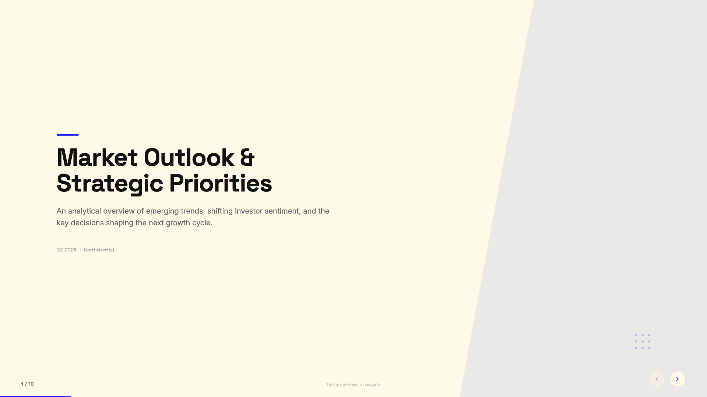</a>
      <p><strong>Blue Professional</strong> — Cream paper background with electric cobalt blue accents; clean modern professional.</p>
    </td>
    <td width="50%" valign="top">
      <a href="./templates/bold-poster/template.html">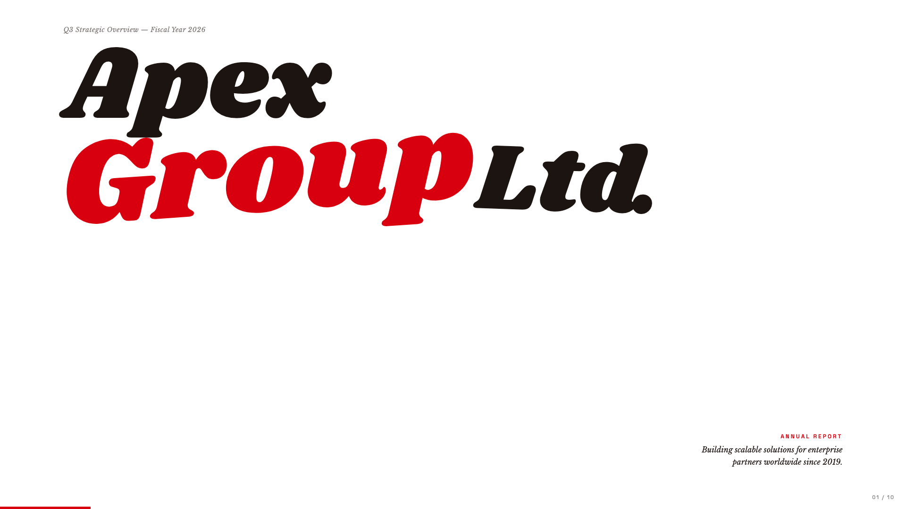</a>
      <p><strong>Bold Poster</strong> — Editorial poster aesthetic with massive Shrikhand display and a single fire-engine red accent.</p>
    </td>
  </tr>
  <tr>
    <td width="50%" valign="top">
      <a href="./templates/broadside/template.html">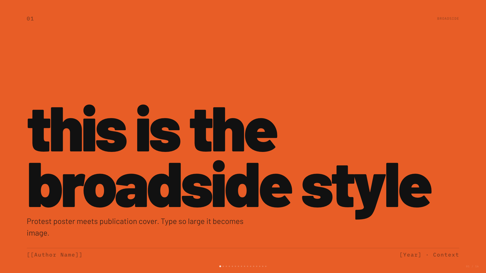</a>
      <p><strong>Broadside</strong> — Dark editorial canvas with a single fire orange accent and bilingual Latin/Chinese type stack.</p>
    </td>
    <td width="50%" valign="top">
      <a href="./templates/capsule/template.html">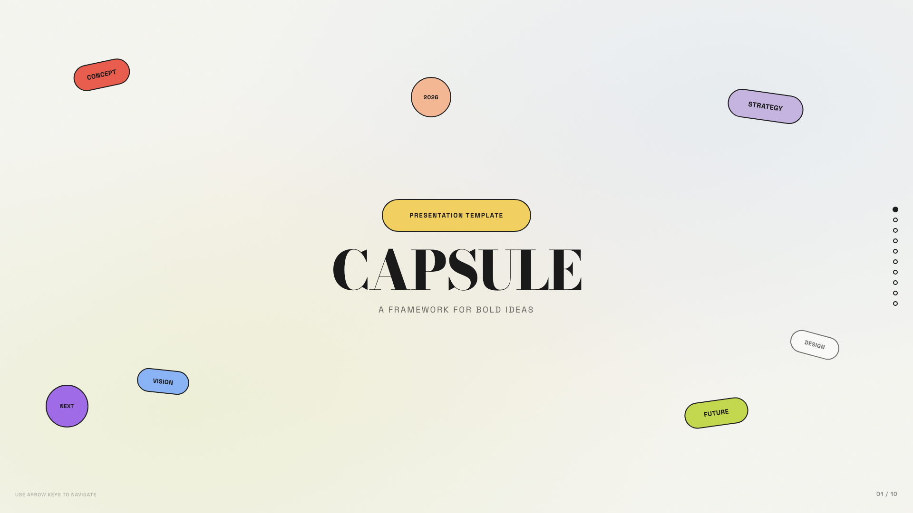</a>
      <p><strong>Capsule</strong> — Modular pill-shaped cards on warm bone with a full pastel-pop palette.</p>
    </td>
  </tr>
  <tr>
    <td width="50%" valign="top">
      <a href="./templates/cartesian/template.html">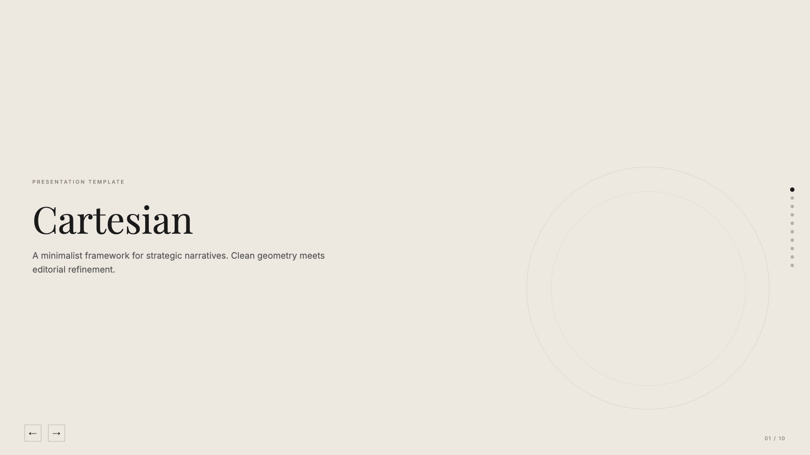</a>
      <p><strong>Cartesian</strong> — Quiet warm-neutral palette with classical Playfair serifs; tasteful and unhurried.</p>
    </td>
    <td width="50%" valign="top">
      <a href="./templates/coral/template.html">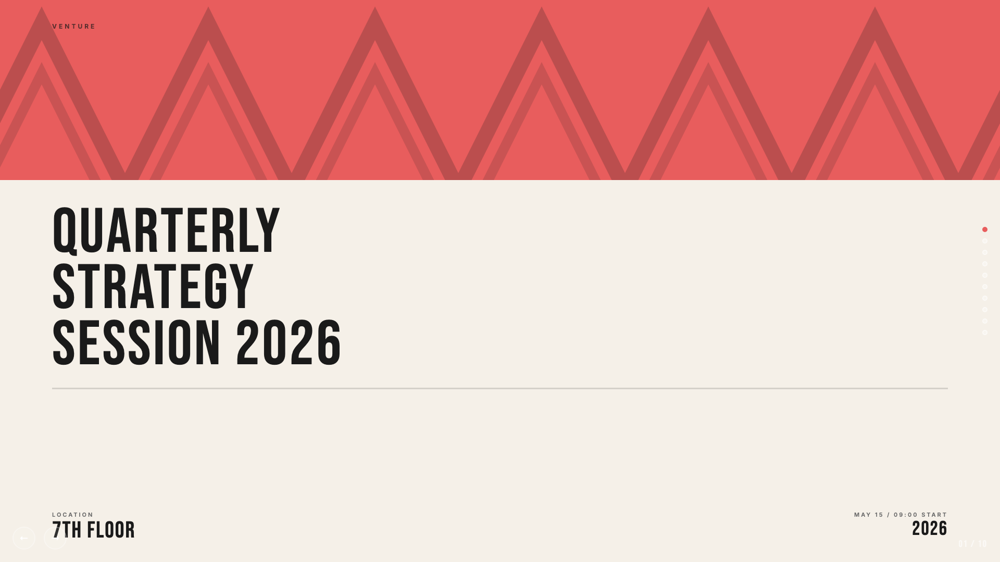</a>
      <p><strong>Coral</strong> — Cream and coral on near-black, set in oversized Bebas Neue.</p>
    </td>
  </tr>
  <tr>
    <td width="50%" valign="top">
      <a href="./templates/creative-mode/template.html">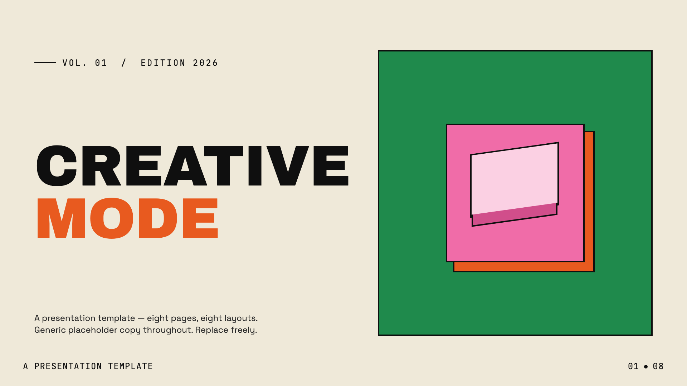</a>
      <p><strong>Creative Mode</strong> — Cream paper canvas with confident multi-color (green, pink, orange, yellow) accents and Archivo Black display.</p>
    </td>
    <td width="50%" valign="top">
      <a href="./templates/daisy-days/template.html"></a>
      <p><strong>Daisy Days</strong> — Cheerful pastel deck with hand-drawn daisies, stars, and rainbows. Friendly, soft, and warm.</p>
    </td>
  </tr>
  <tr>
    <td width="50%" valign="top">
      <a href="./templates/editorial-tri-tone/template.html"></a>
      <p><strong>Editorial Tri-Tone</strong> — Three-color editorial system: dusty pink, mustard cream, and deep burgundy, set in Bricolage + Instrument Serif.</p>
    </td>
    <td width="50%" valign="top">
      <a href="./templates/grove/template.html">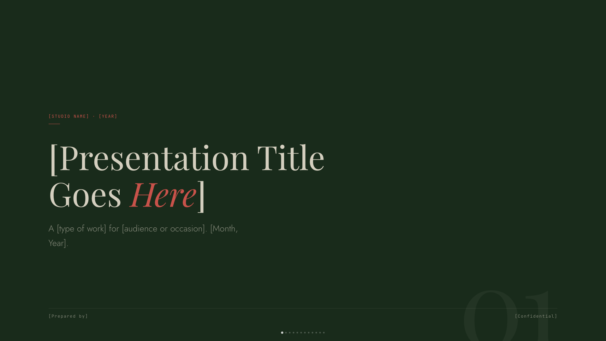</a>
      <p><strong>Grove</strong> — Forest-green canvas with cream type, classical Playfair serifs, and a single rust accent.</p>
    </td>
  </tr>
  <tr>
    <td width="50%" valign="top">
      <a href="./templates/mat/template.html"></a>
      <p><strong>Mat</strong> — Dark sage canvas with bone paper and burnt-orange accent; mid-century modern with wood undertones.</p>
    </td>
    <td width="50%" valign="top">
      <a href="./templates/monochrome/template.html">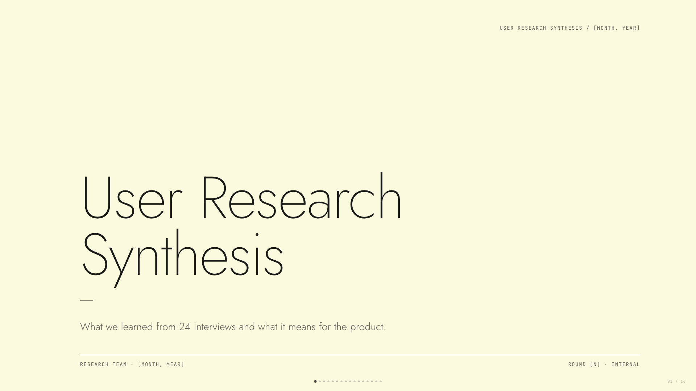</a>
      <p><strong>Monochrome</strong> — Ivory ledger paper with all-black type; Lora serif headlines, Jost body, no color at all.</p>
    </td>
  </tr>
  <tr>
    <td width="50%" valign="top">
      <a href="./templates/neo-grid-bold/template.html">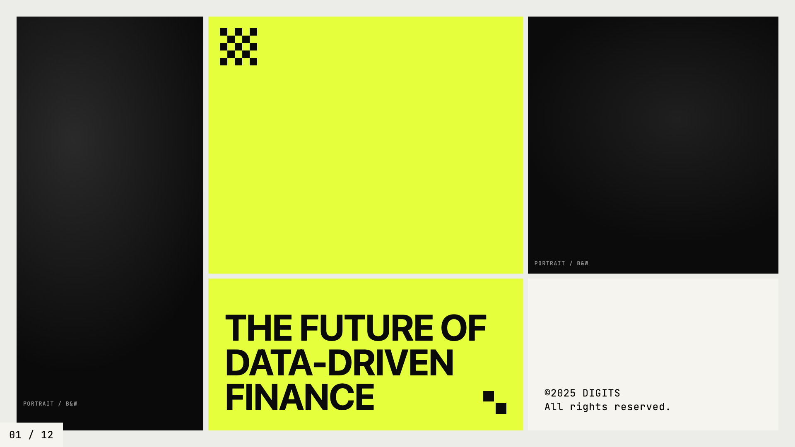</a>
      <p><strong>Neo-Grid Bold</strong> — Editorial neo-brutalism with a single neon yellow accent on off-white paper.</p>
    </td>
    <td width="50%" valign="top">
      <a href="./templates/peoples-platform/template.html"></a>
      <p><strong>People's Platform (Block & Bold)</strong> — Activist poster energy: blue, orange, red on cream, with Alfa Slab + Caveat Brush.</p>
    </td>
  </tr>
  <tr>
    <td width="50%" valign="top">
      <a href="./templates/pin-and-paper/template.html"></a>
      <p><strong>Pin & Paper</strong> — Yellow paper with safety-pin illustrations, ink-blue handwritten Caveat, paper-grain texture.</p>
    </td>
    <td width="50%" valign="top">
      <a href="./templates/pink-script/template.html"></a>
      <p><strong>Pink Script — After Hours</strong> — Black canvas, hot pink accent, pearl-cream paper, Instrument Serif headlines: late-night editorial luxury.</p>
    </td>
  </tr>
  <tr>
    <td width="50%" valign="top">
      <a href="./templates/playful/template.html"></a>
      <p><strong>Playful</strong> — Sun-warm peach background with Syne display: a friendly indie launch deck.</p>
    </td>
    <td width="50%" valign="top">
      <a href="./templates/raw-grid/template.html"></a>
      <p><strong>Raw Grid</strong> — Neo-brutalist deck with thick borders, offset shadows, and a pink/sage/ink palette.</p>
    </td>
  </tr>
  <tr>
    <td width="50%" valign="top">
      <a href="./templates/retro-windows/template.html"></a>
      <p><strong>Retro Windows</strong> — Windows 95 chrome: gray title bars, MS Sans Serif, pixel typography, full nostalgia.</p>
    </td>
    <td width="50%" valign="top">
      <a href="./templates/retro-zine/template.html"></a>
      <p><strong>Retro Zine</strong> — Beige paper with green accent and Bebas Neue + Caveat: a riso-printed zine in HTML form.</p>
    </td>
  </tr>
  <tr>
    <td width="50%" valign="top">
      <a href="./templates/scatterbrain/template.html"></a>
      <p><strong>Scatterbrain</strong> — Post-it inspired: pastel sticky notes, Caveat handwriting, Shrikhand and Zilla Slab type stack.</p>
    </td>
    <td width="50%" valign="top">
      <a href="./templates/signal/template.html">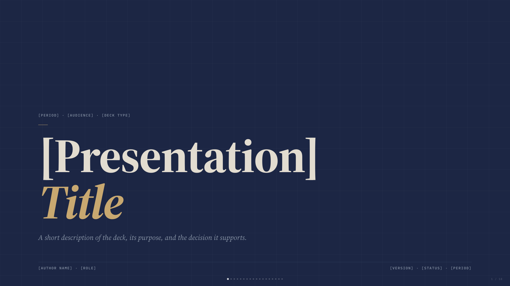</a>
      <p><strong>Signal</strong> — Deep navy canvas with bone paper and a single muted-gold accent; institutional with quiet weight.</p>
    </td>
  </tr>
  <tr>
    <td width="50%" valign="top">
      <a href="./templates/soft-editorial/template.html">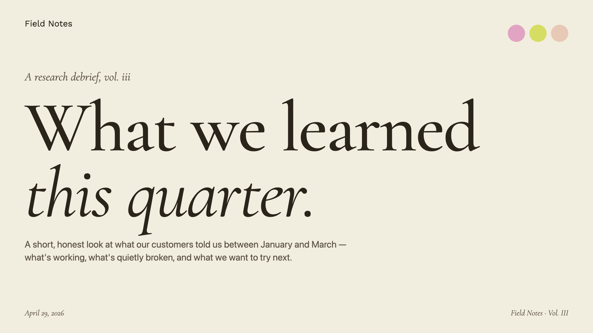</a>
      <p><strong>Soft Editorial</strong> — Cormorant Garamond serif on warm paper with sage, blush, and lemon accents.</p>
    </td>
    <td width="50%" valign="top">
      <a href="./templates/stencil-tablet/template.html"></a>
      <p><strong>Stencil & Tablet</strong> — Bone paper with stencil-cut headlines and a six-color earth palette: archaeology meets brand.</p>
    </td>
  </tr>
  <tr>
    <td width="50%" valign="top">
      <a href="./templates/studio/template.html"></a>
      <p><strong>Studio</strong> — Black canvas with electric-yellow type; high-voltage design studio aesthetic.</p>
    </td>
    <td width="50%" valign="top">
      <a href="./templates/vellum/template.html"></a>
      <p><strong>Vellum</strong> — Deep navy canvas with warm-yellow italic Cormorant serifs and a single dusty teal accent. A quiet, scholarly aesthetic.</p>
    </td>
  </tr>
</table>

## License

[MIT](./LICENSE) — free to use, modify, and distribute.
