# beautiful-html-templates

A library of reusable HTML slide templates designed so that any coding agent can pick the right one and produce a beautiful deck on the user's behalf, automatically.

Agents using the library should read [`AGENTS.md`](./AGENTS.md). It's the operating manual: how to read `index.json`, match the user's brief to a template, clone it, and adapt the content.

## Get started

Copy this to your coding agent:

```
Clone https://github.com/zarazhangrui/beautiful-html-templates and follow the instructions in AGENTS.md to build me a beautiful HTML slide deck.
```

## Gallery

All 31 templates. Three slides per template (cover · mid-deck · later) to give a sense of how each visual system handles different layouts. Click any template name to open its folder on GitHub — the HTML, metadata, and any sibling assets are all there.

### [Soft Editorial](./templates/soft-editorial/)

<p>
  
  
  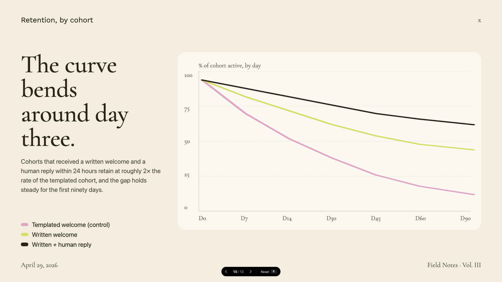
</p>

> Cormorant Garamond serif on warm paper with sage, blush, and lemon accents.

### [Stencil & Tablet](./templates/stencil-tablet/)

<p>
  
  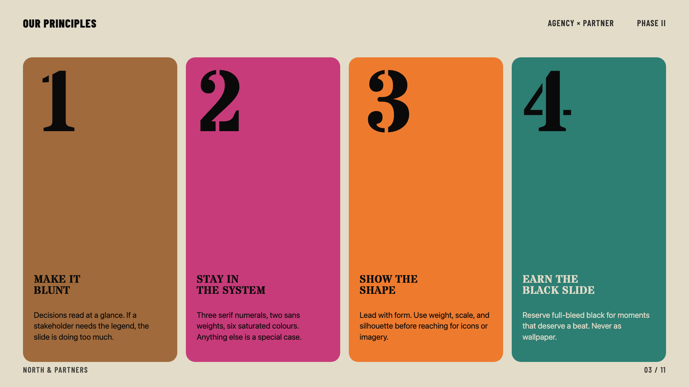
  
</p>

> Bone paper with stencil-cut headlines and a six-color earth palette: archaeology meets brand.

### [Vellum](./templates/vellum/)

<p>
  
  
  
</p>

> Deep navy canvas with warm-yellow italic Cormorant serifs and a single dusty teal accent. A quiet, scholarly aesthetic.

### [Neo-Grid Bold](./templates/neo-grid-bold/)

<p>
  
  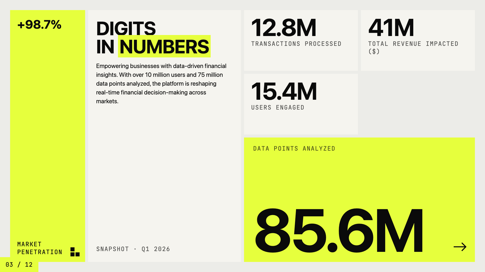
  
</p>

> Editorial neo-brutalism with a single neon yellow accent on off-white paper.

### [Editorial Tri-Tone](./templates/editorial-tri-tone/)

<p>
  
  
  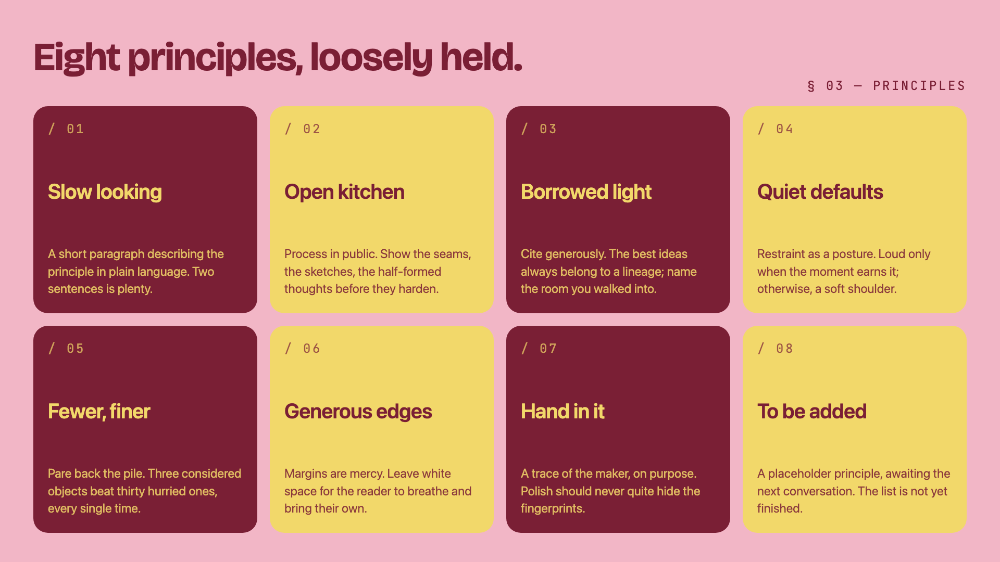
</p>

> Three-color editorial system: dusty pink, mustard cream, and deep burgundy, set in Bricolage + Instrument Serif.

### [Creative Mode](./templates/creative-mode/)

<p>
  
  
  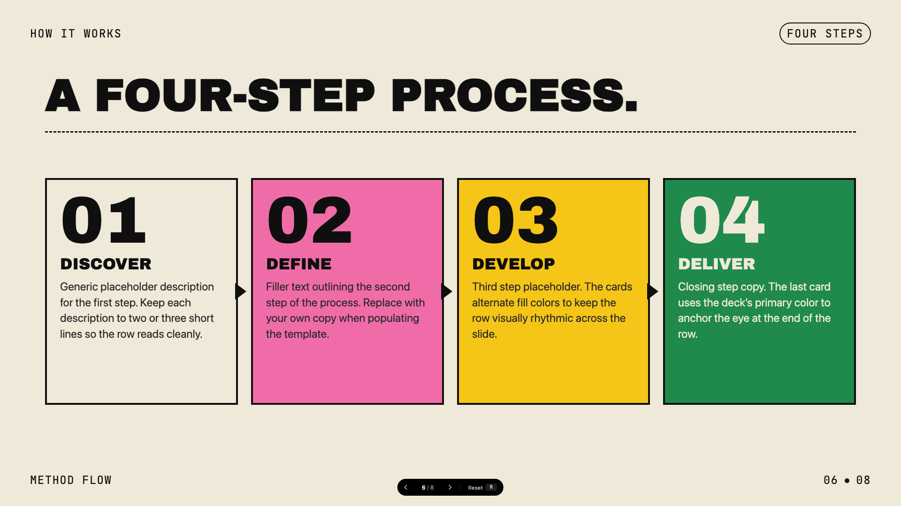
</p>

> Cream paper canvas with confident multi-color (green, pink, orange, yellow) accents and Archivo Black display.

### [Monochrome](./templates/monochrome/)

<p>
  
  
  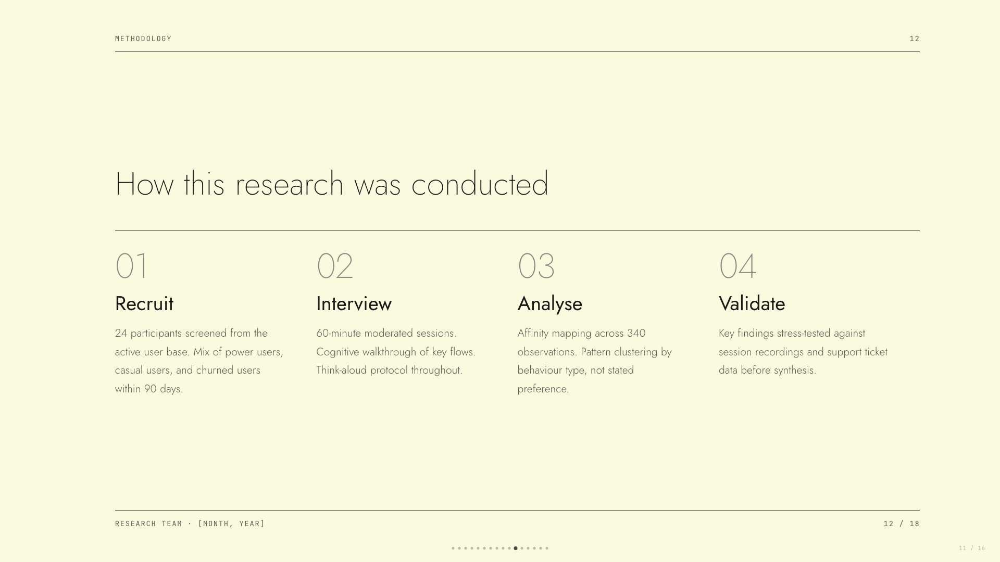
</p>

> Ivory ledger paper with all-black type; Lora serif headlines, Jost body, no color at all.

### [People's Platform (Block & Bold)](./templates/peoples-platform/)

<p>
  
  
  
</p>

> Activist poster energy: blue, orange, red on cream, with Alfa Slab + Caveat Brush.

### [Pink Script — After Hours](./templates/pink-script/)

<p>
  
  
  
</p>

> Black canvas, hot pink accent, pearl-cream paper, Instrument Serif headlines: late-night editorial luxury.

### [8-Bit Orbit](./templates/8-bit-orbit/)

<p>
  
  
  
</p>

> Pixel-art neon arcade aesthetic on a deep navy void.

### [BlockFrame](./templates/block-frame/)

<p>
  
  
  
</p>

> Neobrutalist deck with pastel-neon color blocks and chunky black borders.

### [Blue Professional](./templates/blue-professional/)

<p>
  
  
  
</p>

> Cream paper background with electric cobalt blue accents; clean modern professional.

### [Bold Poster](./templates/bold-poster/)

<p>
  
  
  
</p>

> Editorial poster aesthetic with massive Shrikhand display and a single fire-engine red accent.

### [Broadside](./templates/broadside/)

<p>
  
  
  
</p>

> Dark editorial canvas with a single fire orange accent and bilingual Latin/Chinese type stack.

### [Capsule](./templates/capsule/)

<p>
  
  
  
</p>

> Modular pill-shaped cards on warm bone with a full pastel-pop palette.

### [Cartesian](./templates/cartesian/)

<p>
  
  
  
</p>

> Quiet warm-neutral palette with classical Playfair serifs; tasteful and unhurried.

### [Coral](./templates/coral/)

<p>
  
  
  
</p>

> Cream and coral on near-black, set in oversized Bebas Neue.

### [Daisy Days](./templates/daisy-days/)

<p>
  
  
  
</p>

> Cheerful pastel deck with hand-drawn daisies, stars, and rainbows. Friendly, soft, and warm.

### [Grove](./templates/grove/)

<p>
  
  
  
</p>

> Forest-green canvas with cream type, classical Playfair serifs, and a single rust accent.

### [Mat](./templates/mat/)

<p>
  
  
  
</p>

> Dark sage canvas with bone paper and burnt-orange accent; mid-century modern with wood undertones.

### [Pin & Paper](./templates/pin-and-paper/)

<p>
  
  
  
</p>

> Yellow paper with safety-pin illustrations, ink-blue handwritten Caveat, paper-grain texture.

### [Playful](./templates/playful/)

<p>
  
  
  
</p>

> Sun-warm peach background with Syne display: a friendly indie launch deck.

### [Raw Grid](./templates/raw-grid/)

<p>
  
  
  
</p>

> Neo-brutalist deck with thick borders, offset shadows, and a pink/sage/ink palette.

### [Retro Windows](./templates/retro-windows/)

<p>
  
  
  
</p>

> Windows 95 chrome: gray title bars, MS Sans Serif, pixel typography, full nostalgia.

### [Retro Zine](./templates/retro-zine/)

<p>
  
  
  
</p>

> Beige paper with green accent and Bebas Neue + Caveat: a riso-printed zine in HTML form.

### [Scatterbrain](./templates/scatterbrain/)

<p>
  
  
  
</p>

> Post-it inspired: pastel sticky notes, Caveat handwriting, Shrikhand and Zilla Slab type stack.

### [Signal](./templates/signal/)

<p>
  
  
  
</p>

> Deep navy canvas with bone paper and a single muted-gold accent; institutional with quiet weight.

### [Studio](./templates/studio/)

<p>
  
  
  
</p>

> Black canvas with electric-yellow type; high-voltage design studio aesthetic.

### [Biennale Yellow](./templates/biennale-yellow/)

<p>
  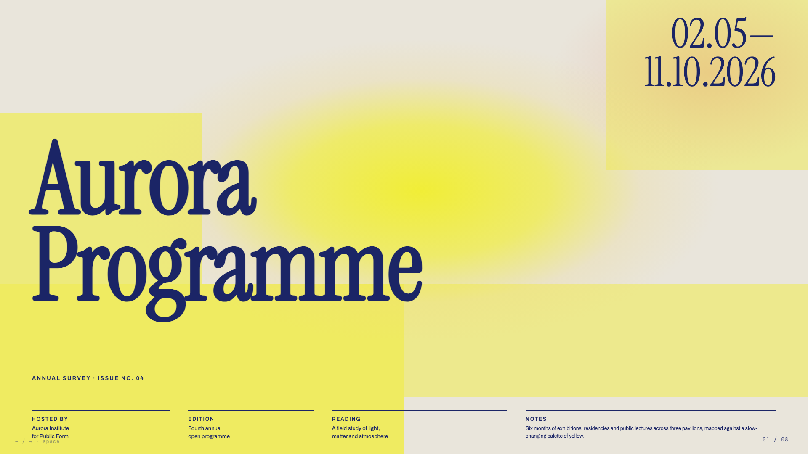
  
  
</p>

> Solar yellow on warm parchment with deep indigo serif and atmospheric sun-glow gradients. Dutch-editorial poster energy.

### [Sakura Chroma](./templates/sakura-chroma/)

<p>
  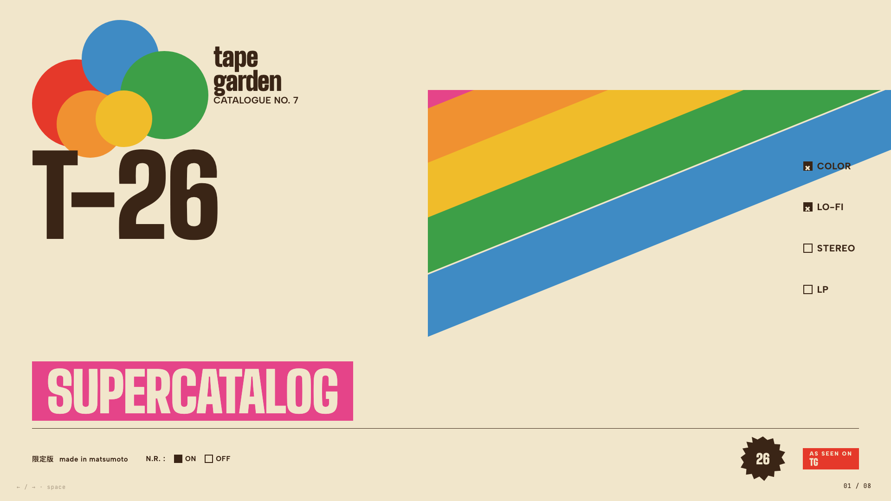
  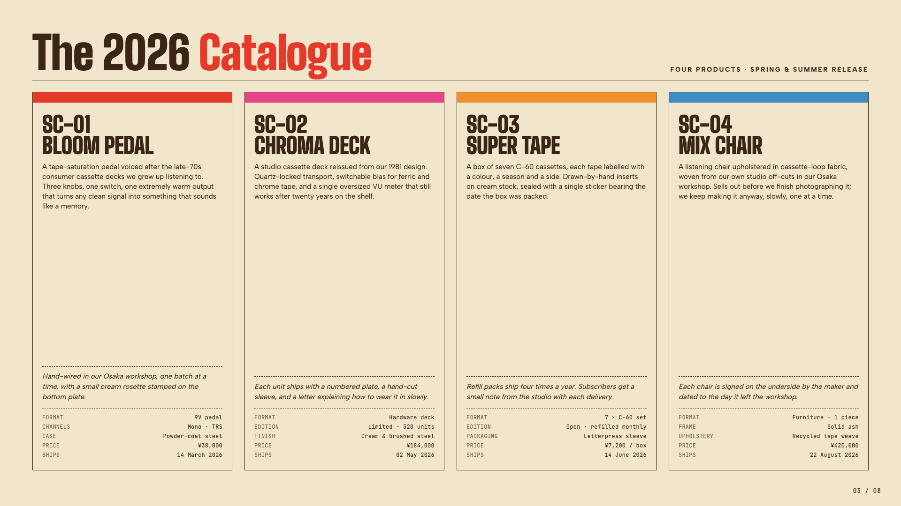
  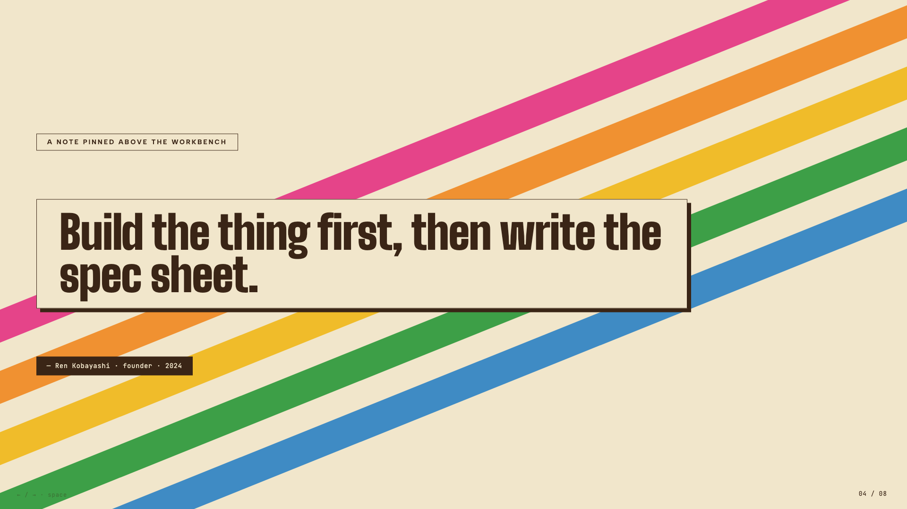
</p>

> Vintage Japanese cassette-package aesthetic: cream paper, diagonal rainbow ribbons, condensed bold type, JIS-style spec checkboxes.

### [Cobalt Grid](./templates/cobalt-grid/)

<p>
  
  
  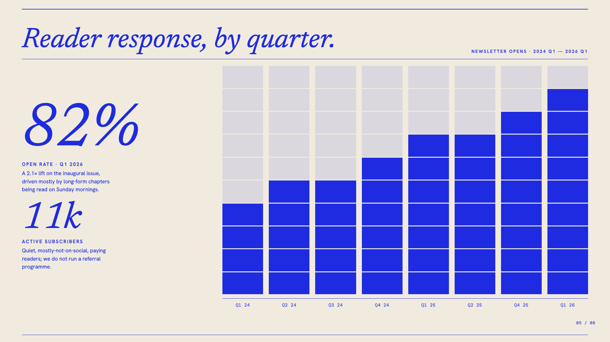
</p>

> Electric cobalt italic serifs on a graph-paper canvas, anchored by stair-stepped pixel-glitch decorations and slim hairline rules.

## License

[MIT](./LICENSE) — free to use, modify, and distribute.
